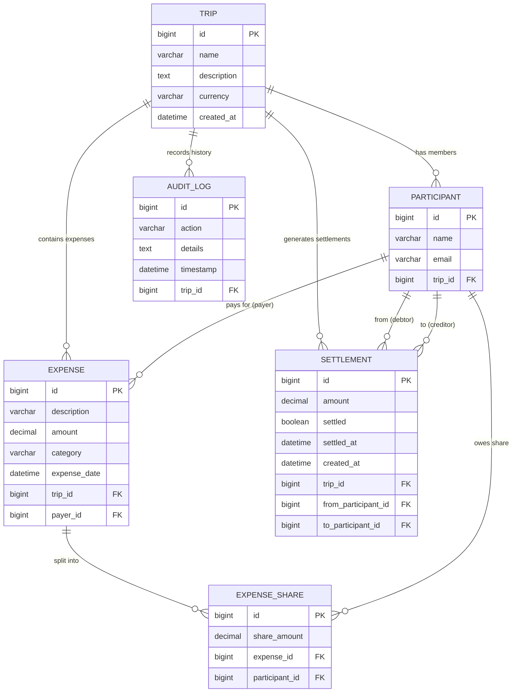

# TripSplit — Database Design & Schema Specification

The TripSplit persistence model is implemented using **Spring Data JPA / Hibernate 7** on top of **MariaDB**.

---

## 1. Entity-Relationship Diagram

---

## 2. Table Specifications

### `trips`
| Column | Type | Constraints | Description |
|---|---|---|---|
| `id` | `BIGINT` | `PRIMARY KEY, AUTO_INCREMENT` | Unique identifier for trip |
| `name` | `VARCHAR(255)` | `NOT NULL` | Trip / expedition title |
| `description` | `TEXT` | `NULLABLE` | Overview and notes |
| `currency` | `VARCHAR(10)` | `NOT NULL, DEFAULT 'USD'` | Base currency code/symbol |
| `created_at` | `DATETIME(6)` | `NOT NULL` | Creation timestamp |

### `participants`
| Column | Type | Constraints | Description |
|---|---|---|---|
| `id` | `BIGINT` | `PRIMARY KEY, AUTO_INCREMENT` | Unique participant ID |
| `name` | `VARCHAR(255)` | `NOT NULL` | Member full name |
| `email` | `VARCHAR(255)` | `NULLABLE` | Member email address |
| `trip_id` | `BIGINT` | `NOT NULL, FK -> trips(id)` | Parent trip foreign key |

### `expenses`
| Column | Type | Constraints | Description |
|---|---|---|---|
| `id` | `BIGINT` | `PRIMARY KEY, AUTO_INCREMENT` | Unique expense ID |
| `description` | `VARCHAR(255)` | `NOT NULL` | Description of outlay |
| `amount` | `DECIMAL(12, 2)` | `NOT NULL, CHECK > 0` | Total cost of expense |
| `category` | `VARCHAR(50)` | `DEFAULT 'OTHER'` | e.g. FOOD, TRANSPORT, LODGING |
| `expense_date` | `DATETIME(6)` | `NOT NULL` | Transaction date |
| `trip_id` | `BIGINT` | `NOT NULL, FK -> trips(id)` | Trip foreign key |
| `payer_id` | `BIGINT` | `NOT NULL, FK -> participants(id)`| Out-of-pocket payer |

### `expense_shares`
| Column | Type | Constraints | Description |
|---|---|---|---|
| `id` | `BIGINT` | `PRIMARY KEY, AUTO_INCREMENT` | Unique share record ID |
| `share_amount` | `DECIMAL(12, 2)` | `NOT NULL, CHECK >= 0` | Member's allocated owed share |
| `expense_id` | `BIGINT` | `NOT NULL, FK -> expenses(id)` | Parent expense |
| `participant_id`| `BIGINT` | `NOT NULL, FK -> participants(id)`| Member sharing cost |

### `settlements`
| Column | Type | Constraints | Description |
|---|---|---|---|
| `id` | `BIGINT` | `PRIMARY KEY, AUTO_INCREMENT` | Unique settlement ID |
| `amount` | `DECIMAL(12, 2)` | `NOT NULL` | Transfer amount to settle |
| `settled` | `BOOLEAN` | `NOT NULL, DEFAULT FALSE` | Payment confirmation flag |
| `settled_at` | `DATETIME(6)` | `NULLABLE` | Timestamp when paid |
| `created_at` | `DATETIME(6)` | `NOT NULL` | Calculation timestamp |
| `trip_id` | `BIGINT` | `NOT NULL, FK -> trips(id)` | Trip foreign key |
| `from_participant_id` | `BIGINT`| `NOT NULL, FK -> participants(id)`| Debtor paying |
| `to_participant_id` | `BIGINT` | `NOT NULL, FK -> participants(id)`| Creditor receiving |

### `audit_logs`
| Column | Type | Constraints | Description |
|---|---|---|---|
| `id` | `BIGINT` | `PRIMARY KEY, AUTO_INCREMENT` | Event ID |
| `action` | `VARCHAR(100)` | `NOT NULL` | Event type enum/string |
| `details` | `TEXT` | `NOT NULL` | Human-readable audit message |
| `timestamp` | `DATETIME(6)` | `NOT NULL` | Exact action timestamp |
| `trip_id` | `BIGINT` | `NOT NULL, FK -> trips(id)` | Trip foreign key |

---

## 3. Key Design Decisions

1. **Cascade Deletion**:
   All child records (`participants`, `expenses`, `shares`, `settlements`, `audit_logs`) configure `CascadeType.ALL` and `orphanRemoval = true` so deleting a trip cleanly purges all related entities without foreign key constraint violations.
2. **Fixed-Point Financial Math (`DECIMAL(12, 2)`)**:
   Floating-point types (`FLOAT`, `DOUBLE`) are strictly avoided. All monetary amounts use Java `BigDecimal` mapped to MariaDB `DECIMAL(12, 2)` to eliminate IEEE 754 precision drift.
3. **Explicit Column Naming**:
   Columns avoiding SQL reserved keywords (e.g. `from_participant_id` instead of `from`, `to_participant_id` instead of `to`).
